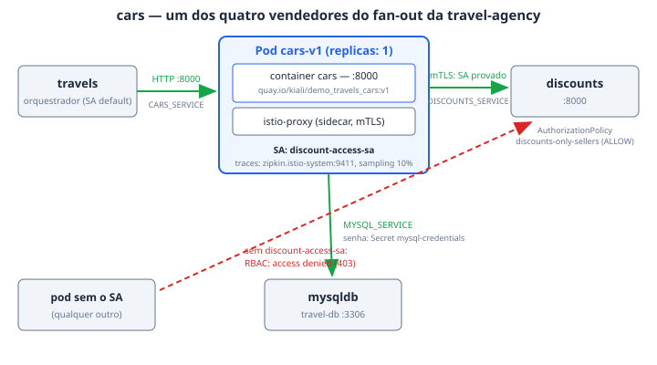

# cars

O `cars` é o serviço de locação de veículos da travel-agency: um dos quatro
vendedores (`cars`, `flights`, `hotels`, `insurances`) que o `travels` agrega a
cada consulta de viagem. Ele existe na demo para dar corpo ao fan-out — todo
request que atravessa o Gateway `prod-web` nos Atos 1 e 2 vira, atrás do
`travels`, uma chamada a ele — e para sustentar o argumento do Ato 7: por rodar
com o ServiceAccount `discount-access-sa`, o `cars` é uma das quatro
identidades que a `AuthorizationPolicy` `discounts-only-sellers` autoriza a
falar com o `discounts`. Quem vende produto consulta desconto; quem não vende,
recebe `403`.

## Como funciona

O `travels` chama o `cars` por HTTP simples, no endereço que recebe pela
variável `CARS_SERVICE` (`http://cars.travel-agency:8000`). O Service `cars` é
um `ClusterIP` comum — porta `8000`, `targetPort 8000` — e o container escuta
onde `LISTEN_ADDRESS: :8000` manda. Não há réplica extra nem recurso reservado:
é carga de demonstração, não de produção.

Para responder, o `cars` faz duas saídas próprias:

- **`discounts`** — via `DISCOUNTS_SERVICE: http://discounts.travel-agency:8000`.
  É aqui que o Service Mesh entra: o pod carrega o label
  `sidecar.istio.io/inject: "true"`, o sidecar fecha mTLS (STRICT no
  namespace), e o SPIFFE ID provado
  (`cluster.local/ns/travel-agency/sa/discount-access-sa`) é o que a
  `AuthorizationPolicy` do `discounts` compara. Identidade, não endereço: nada
  que o chamador possa forjar.
- **`mysqldb`** — via `MYSQL_SERVICE: mysqldb.travel-db:3306`, usuário `root`,
  banco `test`, senha lida do Secret `mysql-credentials` (chave `rootpasswd`).

A observabilidade sai do próprio sidecar: a anotação `proxy.istio.io/config`
aponta o tracing para `zipkin.istio-system:9411` com sampling de 10% e promove
os headers `portal`, `device`, `user` e `travel` a tags customizadas do trace —
é o que faz o Tempo mostrar *quem* pediu o carro, não só *que* pediram.

Uma sutileza do manifesto que custou uma investigação: `metadata.labels` do
Deployment espelha o `spec.selector.matchLabels` de propósito. O plugin
Kubernetes do RHDH casa o `backstage.io/kubernetes-label-selector` contra o
**objeto** Deployment, não contra o pod template — sem o espelho, a aba
Topology fica vazia sem erro em lugar nenhum.

## Fatos medidos

| Fato | Valor (do manifesto) |
| --- | --- |
| Deployment / namespace | `cars-v1` / `travel-agency` |
| Imagem | `quay.io/kiali/demo_travels_cars:v1` (`imagePullPolicy: IfNotPresent`) |
| Réplicas | 1 |
| Porta | `containerPort: 8000`; Service `cars` ClusterIP `8000 → 8000` (`http`) |
| Requests/limits | `resources: {}` — nada reservado, deliberadamente |
| ServiceAccount | `discount-access-sa` (o mesmo dos outros três vendedores) |
| SecurityContext | `allowPrivilegeEscalation: false`, `capabilities.drop: [ALL]`, `readOnlyRootFilesystem: true` |
| Sidecar | injetado por label (`sidecar.istio.io/inject: "true"`); tracing Zipkin `zipkin.istio-system:9411`, sampling 10 |
| Dependências | `discounts` (`:8000`, sob `discounts-only-sellers`), `mysqldb.travel-db:3306` (Secret `mysql-credentials`) |
| Policies que o atravessam | nenhuma diretamente; o tráfego de entrada já passou pela `AuthPolicy` e pelo `PlanPolicy` na borda, e a saída para `discounts` responde à `AuthorizationPolicy` do Service Mesh |

## Onde ver

- **Portal (RHDH)** — Component `cars` no System `travel-agency`: a aba
  **Topology** mostra o Deployment (seletor `app=cars`), a aba **Imagem** lista
  as tags reais do repositório público `kiali/demo_travels_cars` no Quay, e os
  traces usam o serviço `cars.travel-agency` com janela de 7 dias — nunca
  vazia, viva quando há tráfego.
- **Kiali** — namespace `travel-agency`: o grafo desenha
  `travels → cars → discounts`, com o cadeado de mTLS na aresta leste-oeste.
- **Grafana** — os dashboards com a tag `rhcl` aparecem na própria página do
  componente; o tráfego que chega ao `cars` é o mesmo que os painéis de plano
  medem na borda.
- **Console** — Deployment `cars-v1` em `travel-agency`.

## Quando quebra

- **Aba Topology vazia, sem erro** — alguém "limpou" os labels do objeto
  Deployment (não do pod template). O seletor do plugin casa contra o
  Deployment; o espelho `app: cars` em `metadata.labels` é obrigatório.
- **`403 RBAC: access denied` ao consultar desconto** — o pod perdeu o
  ServiceAccount `discount-access-sa` (ou o namespace caiu para `PERMISSIVE` e
  não há principal a comparar). A `AuthorizationPolicy` com `action: ALLOW`
  nega implicitamente tudo que não casa — não existe deny-all escrito.
- **Nó do Topology sem o lápis "edit code"** — as anotações
  `app.openshift.io/vcs-uri`/`vcs-ref` não estão no manifesto de propósito: o
  host do GitLab é específico do cluster e quem as escreve é
  `_vcs_topology()` no `provision.sh`. Sem GitLab elas não entram, e o lápis
  ausente é degradação correta, não defeito.
