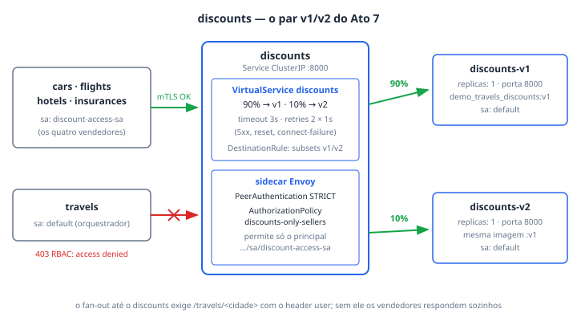

# discounts (v1 e v2)

O `discounts` é o serviço de descontos da travel-agency e o único backend da
demo com **duas versões no ar ao mesmo tempo**, atrás do mesmo `Service`. Ele
existe para o **Ato 7** ("a borda não é a única fronteira"): é nele que o
roteiro demonstra o que o RHCL sozinho não responde — canary por peso
declarado (90/10), identidade leste-oeste por mTLS + SPIFFE e degradação
graciosa quando o nível mais profundo do grafo cai. Ele fica exatamente nesse
nível mais profundo: `prod-web → travels → cars/flights/hotels/insurances →
discounts`, e por isso é o alvo natural das quatro policies de Service Mesh de
`base/mesh/`.

## Como funciona

**Duas versões, uma unidade de decisão.** Os Deployments `discounts-v1` e
`discounts-v2` rodam lado a lado com 1 réplica cada, e o `Service discounts`
seleciona por `app: discounts` **sem** o label `version` — sozinho, ele faz
round-robin cego e a v2 já recebe ~50% do tráfego sem ninguém ter pedido. A
correção vem em duas partes, de propósito separadas: a `DestinationRule
discounts` só **nomeia** os subsets `v1`/`v2` (pelo label `version` que os
Deployments já carregam), e a `VirtualService discounts` decide o **peso** —
90% para v1, 10% para v2 — além de `timeout: 3s` e `retries` (2 tentativas,
`perTryTimeout: 1s`, em `5xx,reset,connect-failure`) que a aplicação não
declara e passa a ter. Subset é propriedade do destino; peso é decisão de
roteamento.

**A mesma imagem nas duas versões — de propósito.** v1 e v2 rodam
`quay.io/kiali/demo_travels_discounts:v1`; o que muda é só o env
`CURRENT_VERSION`. O corpo da resposta é idêntico, então **não dá para ver a
divisão no payload**: ela só existe na métrica
(`istio_requests_total{destination_version=...}`) e no grafo do Kiali. É esse o
ponto do ato — versão é decisão de plataforma, não artefato diferente.

**Quem pode chamar é o sidecar quem decide.** A `AuthorizationPolicy
discounts-only-sellers` (`action: ALLOW`) só aceita o principal SPIFFE
`cluster.local/ns/travel-agency/sa/discount-access-sa` — o ServiceAccount dos
quatro vendedores. O `travels`, que roda com `default`, recebe `403 RBAC:
access denied` do sidecar antes de o processo do `discounts` acordar. A regra
depende da `PeerAuthentication travel-agency-mtls` em `STRICT`: sem mTLS não há
principal provado para comparar. O próprio `discounts` roda com o SA `default`
— o `discount-access-sa` é identidade de **chamador**, não dele.

**Sidecar e rastreio.** O namespace `travel-agency` tem `istio-injection:
enabled`; o v1 ainda carrega `sidecar.istio.io/inject: "true"` no pod template.
Os dois templates configuram o proxy com tracing para
`zipkin.istio-system:9411`, sampling de 10% e `custom_tags` dos headers
`portal`, `device`, `user` e `travel`. O header `user` é também o gatilho do
fan-out: sem ele os quatro vendedores respondem sozinhos e o `discounts` não
recebe nada.

## Fatos medidos

| Fato | Valor (do manifest) |
| --- | --- |
| Namespace | `travel-agency` (`istio-injection: enabled`) |
| Service | `discounts`, ClusterIP, porta `8000/TCP` (`http`) → targetPort `8000`, seletor `app: discounts` (sem `version`) |
| Deployments | `discounts-v1` e `discounts-v2`, **1 réplica cada**, RollingUpdate 25%/25% |
| Imagem | `quay.io/kiali/demo_travels_discounts:v1` — **a mesma nas duas versões** |
| Env | `CURRENT_SERVICE=discounts`, `CURRENT_VERSION=v1`/`v2`, `LISTEN_ADDRESS=:8000` |
| requests/limits | não declarados (`resources: {}`) |
| ServiceAccount | `default` nas duas versões (o `discount-access-sa` é dos vendedores) |
| securityContext | `readOnlyRootFilesystem: true`, `capabilities.drop: [ALL]`, `allowPrivilegeEscalation: false` |
| Tracing (sidecar) | `zipkin.istio-system:9411`, sampling 10%, tags dos headers `portal`/`device`/`user`/`travel` |
| VirtualService | `discounts` — 90% v1 / 10% v2, `timeout: 3s`, retries 2 × `1s` em `5xx,reset,connect-failure` |
| DestinationRule | `discounts` — subsets `v1`/`v2` pelo label `version`; **sem** `trafficPolicy.tls` (vale o auto-mTLS) |
| AuthorizationPolicy | `discounts-only-sellers` — ALLOW só para `cluster.local/ns/travel-agency/sa/discount-access-sa` |
| PeerAuthentication | `travel-agency-mtls`, `mode: STRICT` (pré-condição da policy acima) |

## Onde ver

- **Portal RHDH** — componente `discounts` no System `travel-agency` (tag
  `ato-7`). A aba **Topology** mostra os dois Deployments (o seletor
  `app=discounts` pega v1 e v2 — anotação `acs/deployment-name:
  discounts-v1,discounts-v2`); a aba **Kiali** usa o namespace
  `travel-agency`.
- **Console OpenShift** — Service Mesh → Traffic Graph em *Versioned app
  graph*: duas arestas chegando ao `discounts`, com o percentual em cada uma.
  É a tela do canary. Em Observe → Traces, o serviço é
  `discounts.travel-agency`.
- **Grafana do cluster** — dashboards com a tag `rhcl`
  (`grafana/dashboard-selector: rhcl`); a divisão vem de
  `istio_requests_total{destination_version=...}`, coletada pelo PodMonitor
  `istio-proxies-monitor`.
- **Terminal** — `bash scripts/traffic.sh mesh-split` mede o 90/10 (cada
  requisição a `/travels/<cidade>` vira 4 chamadas ao `discounts`);
  `bash scripts/demo.sh ato7` conduz o ato inteiro; `bash scripts/demo.sh
  falha` injeta 503 e reverte sozinho.

## Quando quebra

- **O canary mede ~50/50 em vez de 90/10.** A `VirtualService` foi revertida
  (algum teste, ou nunca foi aplicada) e voltou o round-robin do `Service`.
  Correção: `oc apply -f base/mesh/virtualservice-discounts.yaml`. O sintoma
  inverso — 100/0 — é fault injection esquecida; o `demo.sh` avisa e reverte.
- **Aba Topology do RHDH vazia, sem erro em lugar nenhum.** O
  `metadata.labels` dos Deployments espelha o `spec.selector.matchLabels` de
  propósito: o plugin Kubernetes casa o `kubernetes-label-selector` contra o
  **objeto** Deployment, não contra o pod template. Remover o espelho apaga o
  grafo em silêncio.
- **Fault injection não demonstra timeout nem retry** — armadilha 12, medida
  neste cluster: delay de 5s com timeout de 3s devolve `200` em 5.03s (o
  timeout mede a chamada upstream; o delay acontece antes), e abort de 50% com
  2 tentativas falha ~55% (o Envoy não re-tenta a própria injeção). Fault
  injection serve para **provocar** a falha, não para exercitar a resiliência
  configurada.
