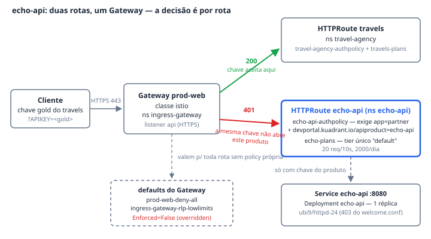

# echo-api — o contraexemplo

O `echo-api` é o **segundo produto** publicado no Gateway `prod-web`: um `httpd`
mínimo, em namespace próprio, sem relação nenhuma com a travel-agency. Ele
existe para o **Ato 3**. Com uma rota só, as policies de Gateway
(`prod-web-deny-all`, `ingress-gateway-rlp-lowlimits`) ficam `Enforced=False`
sem nada a proteger; com o echo de pé, o ato ganha o par gateway-vs-rota — e a
prova de que a governança do RHCL é **por rota**, não por aplicação: a chave
`gold` do travels, válida e classificada, devolve `401` aqui. Assinar um
produto não dá acesso ao Gateway inteiro.

## Como funciona

A `HTTPRoute echo-api` vive no namespace `echo-api` e se anexa por `parentRefs`
ao `prod-web` (namespace `ingress-gateway`) — o mesmo Gateway do travels. O
hostname é específico de cada ambiente (sanitizado como
`echo.travels.example.com` em `platform-reference/`, reescrito pelo patch de
`env/`); descubra-o do cluster:
`oc get httproute echo-api -n echo-api -o jsonpath='{.spec.hostnames[0]}'`.

Os defaults do Gateway são fechados: `prod-web-deny-all` nega tudo e a
`ingress-gateway-rlp-lowlimits` limita baixo, para **toda** rota anexada. O
echo declara as próprias policies com `targetRef` na rota — e, na precedência
do Gateway API, a policy da rota vence a do Gateway. O controller não esconde a
troca: o status da policy do Gateway registra
`Enforced=False (overridden by [... echo-api/echo-api-authpolicy])`, **nomeando
quem venceu, rota por rota**.

O isolamento entre produtos é deliberado e está no selector. A
`echo-api-authpolicy` aceita API key por query string (`?APIKEY=`), mas só
indexa `Secret` com **dois** labels: `app: partner` **e**
`devportal.kuadrant.io/apiproduct: echo-api`. As chaves do travels carregam só
o primeiro — por isso o `401`. A rota do travels continua com o selector
frouxo de propósito: apertá-lo invalidaria as chaves estáticas de
`base/identity/` e quebraria o Ato 2.

A `echo-plans` não está aqui para contar a história de tiers (isso é o Ato 2,
no travels): ela existe porque **sem `PlanPolicy` não se emite chave** —
`spec.planTier` é obrigatório no CRD do `APIKey` e tem de resolver para um tier
existente na rota. Um tier único (`default`) com `predicate: 'true'` é o
catch-all: não há indexação de label para errar em CEL, nem identidade sem
plano.

Duas coisas que parecem defeito e não são: o backend é um `httpd` servindo a
página de teste do RHEL, que o `welcome.conf` entrega com **`403` por design**
— não é um echo de verdade, não devolve o request; e o
`scripts/traffic.sh all` inclui a fatia `echo` no ciclo **sabendo** que toda
requisição dela será `401`, porque nenhuma chave do ambiente carrega o label do
produto. O que interessa medir neste componente é a borda: `401` sem chave,
`429` acima do limite.

## Fatos medidos

| Fato | Valor (do manifesto) |
| --- | --- |
| Namespace | `echo-api` (pod-security `restricted` em `warn`/`audit`) |
| Deployment | `echo-api`, **1 réplica** |
| Imagem | `registry.access.redhat.com/ubi9/httpd-24:latest` (sem pull secret, sem docker.io) |
| Porta do container | `8080` (`http`, TCP) |
| Requests / limits | cpu `10m` / `200m` · memória `64Mi` / `256Mi` |
| Service | `echo-api`, ClusterIP, porta `8080` → `targetPort: http` |
| HTTPRoute | `echo-api`, `parentRef` → Gateway `prod-web` (ns `ingress-gateway`), match `PathPrefix /`, backend `echo-api:8080` |
| AuthPolicy | `echo-api-authpolicy` — API key via query string `APIKEY`; selector `app: partner` + `devportal.kuadrant.io/apiproduct: echo-api`; `allNamespaces: false`; `rules` direto, **não** `defaults.rules` |
| PlanPolicy | `echo-plans` — tier único `default`, `predicate: 'true'`, `20 req/10s` e `2000/dia` |
| APIProduct | `echo-api` — `v1`, `approvalMode: automatic`, `publishStatus: Published`, tags `utility`, `diagnostics` |
| Onde moram as policies | `env/rhcl-1.4_ocp-4.21/devportal/echo-api.yaml` — `APIProduct` é CRD do 1.4 e a `base/` tem de continuar aplicável no 1.2 |
| Onde mora o workload | `platform-reference/workloads/echo-api/` — camada pressuposta, fora do render do overlay |

## Onde ver

- **Portal RHDH** — Component `echo-api` (System `echo-api`, tag `ato-3`):
  Topology e Kiali apontados para o namespace `echo-api`, link **Endpoint**
  para a rota, e a Echo API listada como produto assinável no dev portal.
- **Console OpenShift → Connectivity Link → Policy Topology** — o listener do
  `prod-web` bifurca para as duas rotas, com duas policies chegando no Gateway
  e duas em cada rota. O grafo não marca quem venceu; quem responde é o status:
  `oc get authpolicy prod-web-deny-all -n ingress-gateway -o jsonpath='{range .status.conditions[*]}{.type}={.status} ({.message}){"\n"}{end}'`.
- **Grafana** (pasta *Plataforma*, dashboard *Trafego na borda*) — a tabela por
  `HTTPRoute` mostra a borda como plataforma, não como proxy de um serviço só;
  o echo aparece ali ao lado do travels.
- **`bash scripts/traffic.sh all`** — o ciclo de 8 fatias inclui `echo`; os
  `401` dele são resposta de policy, não queda de ambiente.

## Quando quebra

- **`503` na rota com o Service de pé** — a captura original trouxe só o
  Service; o Deployment vivia numa Application do Argo que não foi lida, e num
  cluster provisionado do zero a rota respondia `503` sem backend. É por isso
  que `echo-api-deployment.yaml` existe em `platform-reference/`.
- **`APIKey` preso em `Pending=AwaitingApproval`** — apagar a `echo-plans`
  não derruba nada visível: o `APIProduct` continua `Ready`, mas nenhum
  `APIKey` resolve o `planTier` obrigatório e o produto vira vitrine sem
  assinatura possível. Medido em cluster.
- **`AuthSchemeNotFound` em toda chave** — embrulhar as regras da AuthPolicy
  em `defaults.rules` (em vez de `rules`) faz o controller do `APIProduct`
  ficar sem `discoveredAuthScheme` e reprovar todo `APIKey`. Mesma armadilha já
  paga no `travel-agency-authpolicy`.
