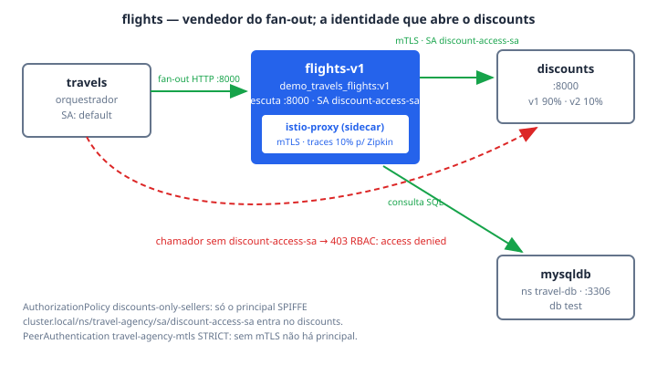

# flights

O **flights** é o serviço de voos da travel-agency: um dos quatro "vendedores"
(`cars`, `flights`, `hotels`, `insurances`) que o `travels` chama em fan-out a
cada consulta que entra pelo Gateway `prod-web`. Ele existe na demo por dois
motivos: sustenta o volume de tráfego interno que os Atos 1–5 medem na borda, e
protagoniza o **Ato 7** ("a borda não é a única fronteira") — o pod roda com o
ServiceAccount `discount-access-sa`, e é essa identidade, provada por mTLS, que
a `AuthorizationPolicy discounts-only-sellers` exige para deixar alguém falar
com o `discounts`. Quem vende produto consulta desconto; o orquestrador não.

## Como funciona

O `travels` conhece o flights pela variável `FLIGHTS_SERVICE`
(`http://flights.travel-agency:8000`) e o chama via o Service ClusterIP
`flights`, porta 8000. O container escuta em `:8000` (`LISTEN_ADDRESS`) e, para
responder, consulta duas dependências:

- **`discounts`** — via `DISCOUNTS_SERVICE=http://discounts.travel-agency:8000`.
  A chamada só passa porque o pod roda com o ServiceAccount
  `discount-access-sa`: a `AuthorizationPolicy discounts-only-sellers`
  (`base/mesh/`) libera apenas o principal SPIFFE
  `cluster.local/ns/travel-agency/sa/discount-access-sa`, e o principal só
  existe porque a `PeerAuthentication travel-agency-mtls` está em `STRICT`.
  Do outro lado, a `VirtualService` do discounts divide o tráfego 90/10 entre
  os subsets v1 e v2 — o flights não sabe disso, e é esse o ponto.
- **`mysqldb`** — via `MYSQL_SERVICE=mysqldb.travel-db:3306`, banco `test`,
  usuário `root`, senha lida do Secret `mysql-credentials` (chave
  `rootpasswd`). Note que o banco vive em **outro namespace** (`travel-db`).

O sidecar entra pelo caminho nativo do Service Mesh: o label
`sidecar.istio.io/inject: "true"` no pod template. A anotação
`proxy.istio.io/config` liga o tracing (Zipkin em
`zipkin.istio-system:9411`, sampling 10%) e promove quatro headers da
aplicação — `portal`, `device`, `user`, `travel` — a tags customizadas do
span, que é o que torna o Ato 5 legível: o trace diz *qual* portal e *qual*
usuário geraram cada chamada interna.

Nenhuma policy do RHCL aponta para o flights diretamente — `AuthPolicy`,
`RateLimitPolicy` e `PlanPolicy` ficam na borda, no par Gateway/HTTPRoute. É a
demonstração da tese: o plano comercial governa a porta da rua; dentro do
Service Mesh quem governa é identidade.

## Fatos medidos

| Fato | Valor (do manifesto) |
| --- | --- |
| Deployment | `flights-v1`, namespace `travel-agency` |
| Service | `flights`, ClusterIP, porta `8000` → targetPort `8000`, seletor `app: flights` |
| Imagem | `quay.io/kiali/demo_travels_flights:v1` |
| Réplicas | 1 |
| Requests/limits | não definidos (`resources: {}`) |
| ServiceAccount | `discount-access-sa` (com imagePullSecret `discount-access-sa-dockercfg-txm4f`) |
| Sidecar | label `sidecar.istio.io/inject: "true"` no pod template |
| Tracing | Zipkin `zipkin.istio-system:9411`, sampling 10%, tags `portal`/`device`/`user`/`travel` |
| Dependências (env) | `DISCOUNTS_SERVICE=http://discounts.travel-agency:8000`; `MYSQL_SERVICE=mysqldb.travel-db:3306` (db `test`, user `root`, Secret `mysql-credentials`/`rootpasswd`) |
| SecurityContext | `readOnlyRootFilesystem: true`, `allowPrivilegeEscalation: false`, capabilities `drop: [ALL]` |
| Policies que o alcançam | `PeerAuthentication travel-agency-mtls` (STRICT, namespace inteiro); `AuthorizationPolicy discounts-only-sellers` (casa o SA dele na saída para o discounts). Nenhuma policy do RHCL o referencia diretamente |
| Estratégia de rollout | RollingUpdate, `maxSurge`/`maxUnavailable` 25% |

## Onde ver

- **Portal RHDH → Component `flights`** — aba **Topology** (o plugin casa
  `backstage.io/kubernetes-label-selector: app=flights` no namespace
  `travel-agency`), aba **Kubernetes** (pods e Service), aba **Kiali**
  (namespace `travel-agency`, provider `default`) mostrando o fan-out
  `travels → flights → discounts` ao vivo.
- **CI** — o projeto `rhcl/travel/flights` no GitLab do cluster; o workflow
  valida os manifests deste componente, então a aba de pipelines tem conteúdo
  próprio.
- **Traces** — link "Traces — flights.travel-agency" no card da entidade
  (console OpenShift, `/observe/traces`, serviço `flights.travel-agency`,
  lookback de 168h). Procure as tags `portal`/`user` nos spans.
- **Grafana** — dashboards com a tag `rhcl` (`grafana/dashboard-selector`);
  o flights aparece no tráfego interno do Service Mesh, não nas séries de
  borda por plano.

## Quando quebra

- **Aba Topology vazia, sem erro em lugar nenhum** — o plugin Kubernetes do
  RHDH casa o label selector contra o **objeto** Deployment, não contra o pod
  template. Por isso `metadata.labels` do `flights-v1` espelha o
  `spec.selector.matchLabels` de propósito; remover esse espelho apaga o nó do
  grafo enquanto pods e Service seguem aparecendo na aba Kubernetes.
- **403 `RBAC: access denied` na chamada ao discounts** — se o pod perder o
  ServiceAccount `discount-access-sa` (ou a `PeerAuthentication` cair para
  `PERMISSIVE`, o que dissolve o principal SPIFFE), a
  `AuthorizationPolicy discounts-only-sellers` deixa de casar e o discounts
  recusa. A policy não tem culpa: ela compara identidade, e identidade sem
  mTLS não existe.
- **Nó do Topology sem o lápis "edit code"** — as anotações
  `app.openshift.io/vcs-uri`/`vcs-ref` não ficam no manifesto (o host do
  GitLab é específico do cluster); quem as escreve é `_vcs_topology()` no
  `provision.sh`. Sem GitLab elas não entram e o lápis some — degradação
  correta, não defeito.
