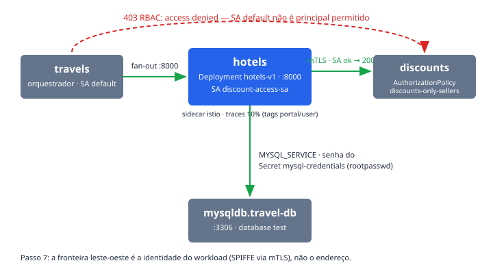

# hotels

O `hotels` é um dos quatro backends "vendedores" do fan-out da travel-agency:
o `travels` orquestra a cotação e consulta `cars`, `flights`, `hotels` e
`insurances` em paralelo, e cada um deles consulta o `discounts` antes de
responder. Na demo ele existe por dois motivos: alimenta o caminho de dados que
os Passos 1–4 medem na borda (todo tráfego que o `prod-web` deixa passar acaba
batendo nele via `travels`) e é um dos protagonistas do **Passo 7** — a prova
de que a borda não é a única fronteira: o `hotels` roda com o ServiceAccount
`discount-access-sa` e por isso a `AuthorizationPolicy` do `discounts` o
aceita, enquanto o `travels`, com o SA `default`, recebe `403` no mesmo
endereço. Identidade de workload, não endereço.

## Como funciona

O Deployment `hotels-v1` (namespace `travel-agency`) roda 1 réplica da imagem
`quay.io/kiali/demo_travels_hotels:v1`, ouvindo em `:8000`
(`LISTEN_ADDRESS`). O Service `hotels` (ClusterIP) publica a porta `http`
8000 → 8000 com selector `app=hotels`; é esse endereço —
`http://hotels.travel-agency:8000` — que o `travels` recebe na env
`HOTELS_SERVICE`.

A cada requisição o `hotels` faz duas chamadas de saída:

- **`discounts`** — env `DISCOUNTS_SERVICE=http://discounts.travel-agency:8000`.
  A chamada só passa porque o pod roda com
  `serviceAccountName: discount-access-sa`: a `AuthorizationPolicy`
  `discounts-only-sellers` (`base/mesh/`) permite apenas o principal SPIFFE
  `cluster.local/ns/travel-agency/sa/discount-access-sa`, provado pelo mTLS.
  O SA já existia em `platform-reference/workloads/travel-agency/` antes de
  qualquer policy — a regra vem do próprio app, a demo só a torna visível.
- **MySQL do `travel-db`** — env `MYSQL_SERVICE=mysqldb.travel-db:3306`,
  usuário `MYSQL_USER=root`, database `MYSQL_DATABASE=test`. A senha vem do
  Secret `mysql-credentials` (chave `rootpasswd`). O Secret nasce no
  namespace `travel-db` junto com o `mysqldb`, e **uma cópia precisa existir
  em `travel-agency`** — Secret é local ao namespace; quem cria a cópia é a
  etapa `platform` do `provision.sh`.

O pod entra no Service Mesh por `sidecar.istio.io/inject: "true"`. A anotação
`proxy.istio.io/config` liga tracing para `zipkin.istio-system:9411` com
sampling de 10% e promove quatro headers a tags de trace (`portal`, `device`,
`user`, `travel`) — é isso que faz o Passo 5 mostrar *quem* pediu, não só *o
que* foi pedido.

## Fatos medidos

| Fato | Valor (do manifest) |
| --- | --- |
| Deployment | `hotels-v1`, namespace `travel-agency` |
| Réplicas | 1 (`RollingUpdate`, maxSurge/maxUnavailable 25%) |
| Imagem | `quay.io/kiali/demo_travels_hotels:v1` |
| Porta | 8000 (containerPort e Service `hotels`, ClusterIP, `http` 8000 → 8000) |
| Requests/limits | nenhum — `resources: {}` |
| ServiceAccount | `discount-access-sa` (o mesmo de `cars`, `flights`, `insurances`; `travels` usa `default`) |
| Secret | `mysql-credentials`, chave `rootpasswd` (cópia em `travel-agency`, criada pelo `provision.sh`) |
| Banco | `mysqldb.travel-db:3306`, usuário `root`, database `test` |
| Dependência de app | `discounts` (`http://discounts.travel-agency:8000`) — refletida no `dependsOn` do catálogo |
| Sidecar | injetado; tracing `zipkin.istio-system:9411`, sampling 10%, tags `portal`/`device`/`user`/`travel` |
| SecurityContext | `readOnlyRootFilesystem`, capabilities `drop: ALL`, sem escalada de privilégio |
| Policies | nenhuma seleciona o `hotels`; a identidade dele é o que a `discounts-only-sellers` **permite** no `discounts` |

## Onde ver

- **Portal RHDH → componente `hotels`**: aba **Topology** (o plugin casa
  `backstage.io/kubernetes-label-selector: app=hotels` contra o Deployment),
  aba **Kiali** (namespace `travel-agency`, provider `default`) e aba
  **Actions** — o CI do espelho `rhcl/travel/hotels` no GitLab valida os
  manifests deste componente.
- **Link "Traces — hotels.travel-agency"** no card do componente: abre o
  console OpenShift em *Observe → Traces* (serviço `hotels.travel-agency`,
  lookback de 168h) com as tags de portal/usuário nos spans.
- **Kiali**: o grafo `travels → hotels → discounts` + `mysqldb`, com o cadeado
  de mTLS nas arestas.
- **Passo 7 do driver**: a saída esperada inclui a linha
  `hotels (sa=discount-access-sa) -> 200`, em contraste com o `403` do
  `travels`; no Grafana (dashboards com tag `rhcl`), o painel de 403 do
  dashboard de segurança em cadeia mostra as recusas da `AuthorizationPolicy`.

## Quando quebra

- **Aba Topology vazia, sem erro em lugar nenhum.** O plugin Kubernetes casa o
  label selector contra o **objeto** Deployment, não contra o pod template.
  Por isso `metadata.labels` do `hotels-v1` espelha o
  `spec.selector.matchLabels` de propósito — remover esse espelho apaga o nó
  do grafo enquanto pods e Service seguem aparecendo na aba Kubernetes.
- **Lápis "edit code" ausente no Topology.** As anotações
  `app.openshift.io/vcs-uri`/`vcs-ref` não ficam no manifest: quem as escreve
  é `_vcs_topology()` no `provision.sh`, com o host do GitLab lido do cluster.
  Sem GitLab elas não entram e o nó aparece sem o lápis — degradação correta,
  não defeito (fixá-las no arquivo quebraria o próximo ambiente, e até
  2026-08-28 apontavam para um repositório privado no GitHub, que rendia tela
  de login no meio da demo).
- **Secret `mysql-credentials` ausente em `travel-agency`.** O Secret original
  vive em `travel-db`; sem a cópia local o container nem inicia, porque a env
  `MYSQL_PASSWORD` referencia a chave `rootpasswd` sem fallback. A etapa
  `platform` do `provision.sh` é idempotente e cria a cópia se faltar.
