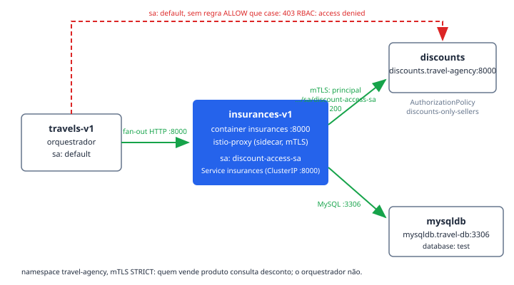

# insurances

O `insurances` é um dos quatro backends do fan-out da travel-agency: a cada
cotação, o `travels` consulta em paralelo `cars`, `flights`, `hotels` e
`insurances`, e cada um deles consulta o `discounts` antes de responder. Na
demo ele nunca aparece na borda — quem fala com o Gateway `prod-web` é só o
`travels` — mas é peça central de dois passos do roteiro: no **Passo 5** os
spans dele aparecem no trace do fan-out, e no **Passo 7** a identidade dele
(ServiceAccount `discount-access-sa`) é o que a `AuthorizationPolicy`
`discounts-only-sellers` usa para provar que a borda não é a única fronteira.

## Como funciona

O Deployment `insurances-v1` roda a imagem de demo do Kiali escutando em
`:8000` (env `LISTEN_ADDRESS`). Para responder uma cotação de seguro ele
depende de dois vizinhos, ambos configurados por variável de ambiente, não por
descoberta mágica:

- **`discounts`** — `DISCOUNTS_SERVICE=http://discounts.travel-agency:8000`.
  É a chamada que o Passo 7 governa: o pod roda com o ServiceAccount
  `discount-access-sa`, o sidecar do Istio (injetado pelo label
  `sidecar.istio.io/inject: "true"`) prova essa identidade via mTLS, e a
  `AuthorizationPolicy` `discounts-only-sellers`
  (`base/mesh/authorizationpolicy-discounts.yaml`) só aceita o principal
  `cluster.local/ns/travel-agency/sa/discount-access-sa`. O `insurances`
  passa; o `travels`, que roda como `default`, leva `403 RBAC: access denied`.
  A regra vem do próprio app — o SA já existia nos manifests antes de a
  policy dar sentido a ele.
- **`mysqldb`** — `MYSQL_SERVICE=mysqldb.travel-db:3306`, database `test`,
  usuário `root`, senha lida do Secret `mysql-credentials` (chave
  `rootpasswd`). Note o namespace: o banco vive em `travel-db`, então a
  chamada cruza namespace dentro do Service Mesh.

Quem chama o `insurances` é o `travels`, via o Service ClusterIP
`insurances` (`insurances.travel-agency:8000`,
env `INSURANCES_SERVICE` do `travels-v1`). Não há Route nem HTTPRoute para
ele: todo o tráfego é leste-oeste.

Dois detalhes do manifest existem por causa do portal, não do runtime:
`metadata.labels` do Deployment **espelha** o `spec.selector.matchLabels` de
propósito (é o que a aba Topology do RHDH casa contra o objeto Deployment), e
as anotações `app.openshift.io/vcs-uri`/`vcs-ref` ficam **fora** do arquivo —
quem as escreve é `_vcs_topology()` no `scripts/provision.sh`, com o host do
GitLab lido do cluster na hora, porque fixá-las quebraria o próximo ambiente.

## Fatos medidos

| Fato | Valor (do manifest) |
| --- | --- |
| Deployment | `insurances-v1`, namespace `travel-agency` |
| Imagem | `quay.io/kiali/demo_travels_insurances:v1` (`imagePullPolicy: IfNotPresent`) |
| Réplicas | 1 (RollingUpdate, `maxSurge`/`maxUnavailable` 25%) |
| Porta | `8000/TCP` no container e no Service `insurances` (ClusterIP, `http`) |
| Requests/limits | não declarados — `resources: {}` |
| ServiceAccount | `discount-access-sa` (imagePullSecret `discount-access-sa-dockercfg-txm4f`) |
| Sidecar | injetado (`sidecar.istio.io/inject: "true"`; `readiness...applicationPorts: ""`) |
| securityContext | `readOnlyRootFilesystem: true`, `capabilities.drop: [ALL]`, `allowPrivilegeEscalation: false` |
| Dependências (env) | `DISCOUNTS_SERVICE=http://discounts.travel-agency:8000`, `MYSQL_SERVICE=mysqldb.travel-db:3306` |
| Secret consumido | `mysql-credentials`, chave `rootpasswd` (`MYSQL_USER=root`, `MYSQL_DATABASE=test`) |
| Policies RHCL diretas | nenhuma — `AuthPolicy`/`PlanPolicy` vivem na borda, no `prod-web`; este serviço não é exposto |
| Policy de Service Mesh | autorizado como caller pela `AuthorizationPolicy` `discounts-only-sellers` (seletor `app=discounts`), sob `PeerAuthentication` STRICT |
| Entidade no catálogo | Component `insurances`, system `travel-agency`, owner `group:default/platform-team`, `dependsOn: component:default/discounts` |

## Onde ver

- **Portal RHDH** — componente `insurances` no system `travel-agency`. Abas
  que este manifest alimenta: **Topology** e **Kubernetes** (seletor
  `app=insurances`, namespace `travel-agency`), **Kiali**
  (`kiali.io/namespace: travel-agency`), **GitLab** (projeto
  `rhcl/travel/insurances` no GitLab do cluster), **Image Registry**
  (`kiali/demo_travels_insurances` no Quay) e os dashboards Grafana
  selecionados pela tag `rhcl`.
- **Traces** — link "Traces — insurances.travel-agency" no card da entidade
  (serviço Jaeger `insurances.travel-agency`, lookback `168h`): é onde o span
  dele aparece dentro do fan-out do Passo 5.
- **Kiali** — no grafo do namespace `travel-agency`, a aresta
  `insurances → discounts` em verde e, durante o Passo 7, a aresta
  `travels → discounts` negada.
- **ACS** — a anotação `acs/deployment-name: insurances-v1` liga a aba de
  segurança ao Deployment certo.

## Quando quebra

Modos de falha reais, documentados nos comentários dos próprios manifests:

1. **Topology vazia sem erro nenhum.** Se o label `app=insurances` sair do
   `metadata.labels` do **objeto** Deployment (não do pod template), a aba
   Topology do RHDH fica sem nó nenhum: o plugin Kubernetes casa o seletor
   contra o Deployment, e o label do template não conta. Pods e Service
   seguem aparecendo na aba Kubernetes, e não há erro em lugar algum. O
   espelhamento de labels no manifest existe exatamente para isso.
2. **Lápis "edit code" ausente ou apontando para login.** As anotações
   `vcs-uri`/`vcs-ref` não são do manifest: sem GitLab no cluster elas não
   entram e o nó do Topology aparece sem o lápis — degradação correta, não
   defeito. Até 2026-08-28 elas estavam fixas apontando para o github.com, e
   como o repositório é privado o lápis levava a uma tela de login no meio da
   demo.
3. **403 no `discounts` vindo do próprio insurances.** A regra ALLOW da
   `discounts-only-sellers` compara o principal SPIFFE que o mTLS provou. Se
   o pod subir sem sidecar (label de injeção removido), não há principal para
   comparar, a regra nunca casa e o `insurances` — que deveria passar — leva
   o mesmo `403 RBAC: access denied` do `travels`.
