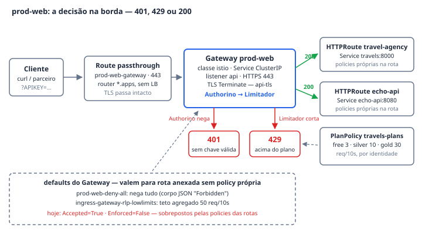

# prod-web — o único ponto de entrada

O `prod-web` é o Gateway (Gateway API, classe `istio`, namespace
`ingress-gateway`) por onde entra **todo** o tráfego da demo — a travel-agency,
o echo-api e qualquer produto que o golden path gerar. É nele que a tese do
repositório se decide: a borda não é um proxy de uma aplicação, é uma
**plataforma compartilhada, fechada por padrão**, que só abre onde alguém
declara uma policy. O `401` do **Ato 1** nasce aqui, e as duas policies que
miram o Gateway são o lado "default da plataforma" do par gateway-vs-rota que
o **Ato 3** conta.

## Como funciona

**Publicado por Route, não por LoadBalancer.** O Gateway carrega a anotação
`networking.istio.io/service-type: ClusterIP` — não há LoadBalancer em SNO — e
o Istio o materializa como o Service `prod-web-istio`. Quem o expõe é o router
do OpenShift: duas `Route` **passthrough**, uma por hostname —
`prod-web-gateway` (`api-travels.apps.<dominio>`) e `echo-api-gateway`
(`echo-travels.apps.<dominio>`) — ambas apontando para `prod-web-istio:443`.
Passthrough porque o TLS não termina no router: quem termina é o Envoy do
Gateway (`mode: Terminate`), com o Secret `api-tls` — uma **cópia do wildcard
que o cluster já tem** (`cert-manager-ingress-cert`, de `openshift-ingress`),
não um certificado emitido por `TLSPolicy` (ver "Quando quebra").

**Um listener, wildcard de propósito.** O listener `api` (HTTPS `443`) serve
`*.<dominio>` com `allowedRoutes: from: All`: é o wildcard que deixa as duas
rotas — e as próximas — se anexarem, e são as rotas que dão o que fazer às
policies de Gateway; com uma rota só, o Ato 3 perde o par. O hostname real é
efêmero, descubra-o do cluster:
`oc get ingresses.config cluster -o jsonpath='{.spec.domain}'`.

**Deny-all: o default é fechado.** A `prod-web-deny-all` mira o Gateway
(`targetRef: Gateway/prod-web`) e não declara nenhuma regra de autenticação —
só a resposta de recusa: um corpo JSON (`"error": "Forbidden"`,
`content-type: application/json`) dizendo que o operador do gateway nega por
padrão e que a saída é criar uma AuthPolicy específica para a rota. O efeito
medido no roteiro: rota anexada **sem** AuthPolicy própria responde `403` com
esse corpo. Quando a rota declara a sua, a precedência do Gateway API entrega o
resto — a policy da rota **vence**, e o status da policy do Gateway registra a
troca nomeando quem venceu, rota por rota:
`Enforced=False (overridden by [travel-agency/travel-agency-authpolicy echo-api/echo-api-authpolicy])`.
Hoje as duas rotas declaram as suas, então as duas policies de Gateway estão
`Accepted=True, Enforced=False` — não é defeito, é o Ato 3 funcionando.

> **Uma ressalva registrada no próprio manifesto**: o rego da regra de
> autorização é `allow = true`, e o `kustomization.yaml` de
> `base/policies-security/` o marca como *bug herdado — o nome diz deny mas
> libera*, com correção prometida "via patch em overlay". O patch não existe em
> nenhum overlay versionado: o render de `overlays/rhcl-1.4` entrega o rego
> original. O RUNBOOK, por outro lado, mediu `403` na rota sem policy própria.
> As duas afirmações convivem no repositório; antes de contar o Ato 1 com uma
> rota sem AuthPolicy, meça no cluster.

**Teto agregado ≠ limite por plano.** A `ingress-gateway-rlp-lowlimits` é o
mesmo desenho no eixo de tráfego: `50 req/10s`, **sem `counters`** — uma janela
agregada, todo o tráfego conta junto, sem distinguir usuário. É proteção de
borda, não produto comercial. O produto são os limites do `PlanPolicy`
`travels-plans` (free `3`, silver `10`, gold `30` por 10 s, contador **por
identidade** classificada em tier), que geram a RLP de rota que sobrepõe o
teto. O teto continua de pé como default: a próxima rota que se anexar sem
policy própria nasce limitada a 50/10s — e negada pelo deny-all. Por isso
**não se pendura rota de amostra no `prod-web`**: uma amostra sem RHCL
responderia `401`/`403` em tudo, com a causa num objeto de outro namespace.

**Quem governa o quê.** O Gateway mora em `platform-reference/gateway/` —
camada **pressuposta**, sem `kustomization.yaml` de propósito, fora do alcance
de `oc apply -k`; o hostname real e o label `kuadrant.io/lb-attribute-geo-code`
entram por patch registrado ali (`patch-gateway-prod-web.yaml`). As duas
policies moram em `base/` — camada de demo, aplicada pelo overlay. A fronteira
é deliberada: a demo **governa** as policies e **pressupõe** o Gateway.

## Fatos medidos

| Fato | Valor (do manifesto) |
| --- | --- |
| Gateway | `prod-web`, ns `ingress-gateway`, `gatewayClassName: istio`, anotação `networking.istio.io/service-type: ClusterIP` |
| Listener | `api` — HTTPS `443`, hostname wildcard (`*.travels.example.com` sanitizado; no cluster, `*.apps.<dominio>`), `allowedRoutes: {namespaces: {from: All}}` |
| TLS | `mode: Terminate`, Secret `api-tls` — cópia do wildcard do cluster (`cert-manager-ingress-cert`, ns `openshift-ingress`); **não** vem de TLSPolicy |
| Publicação | Routes **passthrough** `prod-web-gateway` (`api-travels.apps.<dominio>`) e `echo-api-gateway` (`echo-travels.apps.<dominio>`) → Service `prod-web-istio:443`; sem LoadBalancer |
| AuthPolicy de Gateway | `prod-web-deny-all` — sem regra de autenticação; `response.unauthorized` com corpo JSON (`"error": "Forbidden"`, `content-type: application/json`); rego registrado: `allow = true` (ver ressalva acima) |
| RateLimitPolicy de Gateway | `ingress-gateway-rlp-lowlimits` — `default-limits: 50 req / 10s`, sem `counters` (teto agregado) |
| Rotas anexadas | `travel-agency/travel-agency` (→ `travels:8000`) e `echo-api/echo-api` (→ `echo-api:8080`), ambas `PathPrefix /` |
| Estado das policies de Gateway | `Accepted=True` · `Enforced=False` — mensagem *overridden by* nomeando as policies de rota que venceram |
| Contraste com os planos | `travels-plans` (PlanPolicy): free `3/10s`, silver `10/10s`, gold `30/10s`, catch-all `unclassified 1/60s` — por identidade |
| DNSPolicy / TLSPolicy | `prod-web-dnspolicy` e `prod-web-tls-policy` existem em `platform-reference/policies-connectivity/` e **não estão aplicadas** neste cluster |
| Namespace | `ingress-gateway` — pod-security `restricted` em `warn`/`audit` |
| Onde mora | Gateway em `platform-reference/gateway/` (pressuposto, sem kustomization); policies em `base/policies-security/` e `base/policies-traffic/` (camada de demo) |

## Onde ver

- **Portal RHDH** — System `rhcl-ingress`: o Resource `prod-web` (tipo
  `gateway`, tags `ato-1`/`ato-3`) tem link direto para a API e para o objeto
  no console; as policies aparecem como Resources `dependencyOf` dele, com o
  label `rhcl.demo/escopo-policy: gateway` marcando a distinção que o Ato 3
  explica.
- **Console OpenShift → Connectivity Link → Policy Topology** — o listener do
  `prod-web` bifurca para as duas rotas, com `prod-web-deny-all` e
  `ingress-gateway-rlp-lowlimits` chegando no nó do Gateway. O grafo não marca
  quem venceu; quem responde é o status:
  `oc get authpolicy prod-web-deny-all -n ingress-gateway -o jsonpath='{range .status.conditions[*]}{.type}={.status} ({.message}){"\n"}{end}'`.
- **Grafana** (pasta *Plataforma*, dashboard *Trafego na borda*) — *p95 na
  borda*, *Taxa de 5xx*, *Requisicoes na janela* e *Barradas na borda*
  (`response_code=~"401|429"`), tudo sobre
  `istio_requests_total{namespace="ingress-gateway"}`: a requisição barrada
  nunca chega à aplicação, a série nasce aqui.
- **`bash scripts/preflight.sh`** — a seção *exposicao das APIs* cruza cada
  hostname de HTTPRoute com as Routes que o router conhece; é o teste de que a
  publicação por passthrough está inteira.

## Quando quebra

- **HTTPRoute verde, `503` lá fora** — hostname anexado ao Gateway mas sem
  Route passthrough no router. O `503` é do router (página HTML, HTTP/1.0), não
  do Envoy — e requisição que não chega não vira série: o sintoma que aparece é
  **métrica vazia no Grafana**. Já aconteceu com duas APIs (cobrança,
  pagamentos); o preflight acusa e manda criar a Route para `prod-web-istio`.
- **Certificado `Ready=True`, host que não resolve** — emitir por
  TLSPolicy/DNS01 para um host de dois rótulos sob `apps.<dominio>` cria
  `_acme-challenge.<host>` e, pela RFC 4592, o wildcard `*.apps` deixa de
  cobrir o nome. O certificado sai pronto e o diagnóstico aponta para o lugar
  errado. É por isso que DNSPolicy e TLSPolicy vivem em `platform-reference/`
  **sem estar aplicadas**, e `api-tls` é cópia do wildcard do cluster.
- **`Programmed=False` respondendo `200`** — sem a anotação
  `networking.istio.io/service-type: ClusterIP`, o Service nasce
  `LoadBalancer`, o `EXTERNAL-IP` fica `<pending>` para sempre e o Gateway
  reporta que não publicou — enquanto a Route passthrough segue entregando
  `200`. Quem confere por `oc get gateway` lê "não publicou" sobre algo
  publicado.
