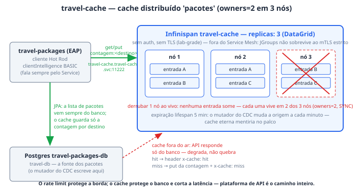

# travel-cache (Data Grid)

O `travel-cache` é o cluster Infinispan (Red Hat Data Grid, pelo operador) que
guarda o cache distribuído `pacotes` — 3 nós, cada entrada viva em 2 deles. Na
tese da demo ele é o argumento de que **plataforma de API é o caminho inteiro,
não só o gateway**: o rate limit do RHCL protege a borda, mas quem protege o
banco e corta a latência da consulta é o cache — e é por isso que ele aparece
no Ato 6 como parte da cadeia de dados do System `travel-packages` no portal.
Ele também carrega a cena de replicação mais barata da demo: derrubar
qualquer um dos três nós ao vivo e nenhuma entrada sumir, porque `owners=2`
garante que cada uma existe em dois lugares.

## Como funciona

**O cluster.** O CR `Infinispan` (`infinispan.org/v1`) declara `replicas: 3` e
`service.type: DataGrid`; o operador materializa os três nós no namespace
`travel-cache` e publica o Service homônimo com o endpoint Hot Rod em
`:11222`. O namespace fica **fora do Service Mesh de propósito**
(`00-namespaces.yaml`): o Infinispan forma cluster por JGroups/DNS_PING, que o
mTLS estrito quebra — e quebra sem mensagem útil. O endpoint roda **sem
autenticação e sem TLS** (`endpointAuthentication: false`,
`endpointEncryption: None`) — lab-grade, e é o que faz o cliente no EAP ser
poucas linhas de configuração em vez de um keystore. Se um dia endurecer, o
operador gera as credenciais sozinho e o EAP passa a ler do Secret
`travel-cache-generated-secret`.

**A cache `pacotes`.** Declarada num CR próprio (`Cache`,
`infinispan.org/v2alpha1`, `clusterName: travel-cache`):
`distributedCache` em modo `SYNC` com `owners: 2` — com 3 nós, cada entrada
vive em exatamente 2 deles, então perder qualquer nó não perde dado.
`statistics: true` liga a contagem de hits/misses no servidor. A expiração é
`lifespan: 300000` (5 minutos), e o número não é arbitrário: o dado de origem
muda a cada minuto pelo mutador do CDC, e uma cache eterna mentiria no palco.

**Quem lê e escreve.** O cliente é a aplicação EAP `travel-packages`
(`CacheDePacotes.java`), via Hot Rod no endereço estável
`travel-cache.travel-cache.svc:11222` (env `DATAGRID_HOST`/`DATAGRID_PORT`/
`DATAGRID_CACHE` do `WildFlyServer`). O padrão é **cache-aside da contagem,
não da lista**: a consulta `GET /api/pacotes/{destino}` busca a chave
`contagem:<destino>`, responde com o header `x-cache: hit|miss`, e no miss
grava a contagem de volta — os pacotes em si vêm **sempre** do Postgres por
JPA. Guardar só a contagem é o suficiente para a cena de replicação sem
precisar serializar entidade em Hot Rod. O `clientIntelligence` é `BASIC` de
propósito: a topologia que o servidor devolve são IPs de pod, que mudam a cada
reinício; com BASIC o cliente fala sempre pelo Service — custa um salto,
economiza um modo de falha intermitente no palco.

**Degrada em vez de quebrar.** Se o cache não subiu — ou o namespace nem
existe — o cliente loga um WARNING (`Data Grid indisponivel -- servindo
direto do banco`) e a API continua respondendo, direto do Postgres. Cache
indisponível é lentidão, não indisponibilidade: o `/api/saude` reporta o
estado do cache, mas quem decide o readiness é só o banco.

## Fatos medidos

| Fato | Valor (do manifest `platform-reference/travel-packages/03-datagrid.yaml`) |
| --- | --- |
| Objetos | `Infinispan` `travel-cache` (`infinispan.org/v1`) + `Cache` `pacotes` (`infinispan.org/v2alpha1`) |
| Namespace | `travel-cache` — **fora** do Service Mesh (JGroups × mTLS estrito) |
| Réplicas | 3 nós, `service.type: DataGrid` |
| Recursos por nó | memória `1Gi:512Mi`, cpu `500m:200m` (sintaxe `limite:request` do operador) |
| Porta / endereço | Hot Rod `:11222`, Service `travel-cache.travel-cache.svc` |
| Segurança | `endpointAuthentication: false`, `endpointEncryption: None` — lab-grade |
| Topologia da cache | `distributedCache`, `mode: SYNC`, `owners: 2`, `statistics: true` |
| Expiração | `lifespan: 300000` ms (5 min) — a origem muda pelo mutador do CDC |
| Cliente | EAP `travel-packages`, Hot Rod, `clientIntelligence BASIC`, chave `contagem:<destino>` |
| Secret | nenhum hoje; endurecendo, o operador gera `travel-cache-generated-secret` |
| Policies do RHCL | nenhuma seleciona o cache — é tráfego leste-oeste, atrás da borda; a governança acontece no Gateway `prod-web` |
| Entidade no catálogo | Resource `travel-cache` (type `cache`, System `travel-packages`), ancorada em `infinispan/travel-cache/travel-cache` |

## Onde ver

- **Portal RHDH → Resource `travel-cache`** ("Data Grid — cache de pacotes",
  System *Pacotes de viagem*): a entidade se ancora no objeto real via
  `rhcl.demo/cluster-object` e, num cluster sem a etapa `pacotes` do
  `provision.sh`, sai do catálogo sozinha em vez de descrever o que não
  existe. O grafo de dependências mostra `travel-cache → travel-cdc` e o
  Component EAP dependendo dele.
- **Na própria API**: `curl` em `https://pacotes-travels.apps.<domínio>/api/pacotes/<destino>`
  duas vezes seguidas — a primeira responde `x-cache: miss`, a segunda `hit`.
  Espere 5 minutos e o `miss` volta: é o `lifespan` trabalhando.
- **A cena de replicação**: `oc get pods -n travel-cache` mostra os 3 nós;
  deletar qualquer um e repetir o `curl` — a contagem continua respondendo,
  porque cada entrada vive em 2 nós.
- **`/api/saude`** do `travel-packages` reporta se o cache está de fato no
  caminho ou se a API está no modo degradado.

## Quando quebra

- **Cache fora do ar sem drama.** É o modo de falha *desenhado*: o cliente
  loga WARNING (não SEVERE — modo degradado previsto não deve mandar ninguém
  investigar um não-problema) e serve direto do banco. O sintoma correto é
  `x-cache: miss` para sempre e latência maior, nunca 5xx. Se a API caiu, o
  culpado não é este componente.
- **Pôr o namespace no Service Mesh.** O cluster JGroups não forma sob mTLS
  estrito, e a falha vem **sem mensagem útil** — foi por isso que
  `travel-cache` nasceu fora da malha de sidecars (comentário de
  `00-namespaces.yaml`). Adicionar `istio-injection: enabled` aqui é o jeito
  mais rápido de transformar 3 nós num cluster que nunca se encontra.
- **Trocar o `clientIntelligence` para o padrão.** Com
  `HASH_DISTRIBUTION_AWARE`, o servidor devolve a topologia como IPs de pod —
  que o cliente de fora do namespace até alcança, mas que mudam a cada
  reinício. O resultado é falha intermitente que some quando se olha: o
  `BASIC` do `CacheDePacotes.java` existe exatamente para esse modo de falha
  não subir ao palco.
