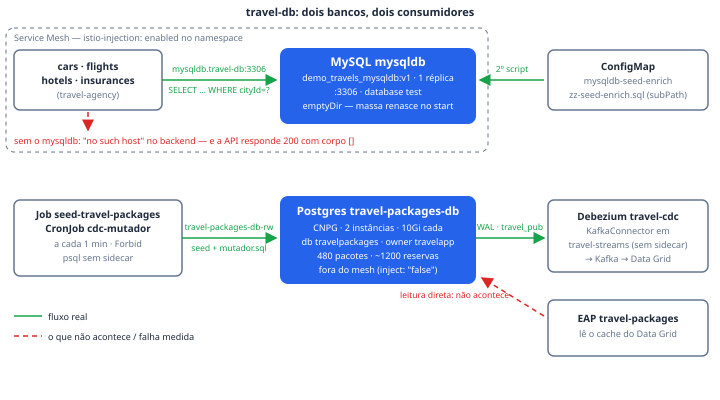

# travel-db

O `travel-db` é o namespace de dados da demo, e carrega **dois bancos com
papéis distintos**. O MySQL `mysqldb` é quem os quatro backends do fan-out
(`cars`, `flights`, `hotels`, `insurances`) consultam — é ele que transforma o
`200` medido nos Passos 1–4 em um payload com conteúdo: sem este banco a API
responde `200` com corpo vazio, e o roteiro passa sem que ninguém perceba. O
Postgres `travel-packages-db` (CloudNativePG) é o lastro do System
`travel-packages` do Passo 6: a fonte do CDC, com 480 pacotes e 1.200 reservas
de seed, de onde o Debezium lê o WAL que mantém o cache do Data Grid vivo. O
namespace separado não é acidente: nas variantes deste workshop o banco vive
fora do cluster, com a ponte feita por Red Hat Service Interconnect (Skupper)
— mover o Deployment de lugar e trocar o Service não muda nenhuma aplicação,
porque todas continuam resolvendo o mesmo nome.

## Como funciona

### O MySQL do fan-out

O Deployment `mysqldb` roda 1 réplica da imagem
`quay.io/kiali/demo_travels_mysqldb:v1`, ouvindo em `:3306`, publicada pelo
Service `mysqldb` (ClusterIP, selector `app=mysqldb`). Os quatro vendedores do
fan-out o alcançam por `mysqldb.travel-db:3306` (env `MYSQL_SERVICE` de cada
Deployment em `platform-reference/workloads/travel-agency/`), usuário `root`,
database `test`, senha no Secret `mysql-credentials` (chave `rootpasswd`) —
que precisa existir também em `travel-agency`, porque Secret é local ao
namespace.

O dado **nasce a cada start do pod**: o data dir da imagem vem vazio e não há
PVC de propósito — tudo em `emptyDir`, porque o schema e a massa são recriados
pelos scripts de `/docker-entrypoint-initdb.d`, em ordem alfabética:

1. **`mysqldb-init.sql`** (da imagem): o schema e as 45 capitais europeias com
   lat/lng reais — mas ofertas formulaicas ("Red Airlines", "Sports Car",
   preço = progressão aritmética em `cityId`).
2. **`zz-seed-enrich.sql`** (ConfigMap `mysqldb-seed-enrich`, montado via
   `subPath`): reescreve `flights`/`hotels`/`cars`/`insurances` com catálogos
   reais — 16 companhias aéreas, 12 redes hoteleiras, 10 modelos de carro, 8
   seguradoras — e dá ao preço duas dimensões: **custo da praça** (índice de
   0.60 em Kiev a 1.80 em Mônaco) e **porte da cidade** (um hub como Amsterdam
   recebe ~7 voos, um microestado como Vaduz ~2). Sem `RAND()`: a dispersão
   vem de `MOD` com primos, então dois pods sobem com exatamente a mesma massa
   — uma demo em que o preço muda a cada restart é uma demo que ninguém
   consegue ensaiar. A tabela `cities` não é tocada.

O namespace tem `istio-injection: enabled`, então o `mysqldb` entra no Service
Mesh e aparece no grafo do Kiali com mTLS — é a razão declarada do label no
próprio manifest ("por causa do mysqldb do Passo 7").

### O Postgres do travel-packages

O Cluster CNPG `travel-packages-db` roda **2 instâncias** (primária + réplica
de streaming — a história de HA que a demo conta), imagem
`ghcr.io/cloudnative-pg/postgresql:18.4-system-trixie`, 10Gi de storage por
instância, `podAntiAffinityType: preferred`. O `initdb` cria o database
`travelpackages` com owner `travelapp`; o role `debezium` é gerenciado pelo
próprio CNPG (`managed.roles`, com `login` e `replication`, sem superusuário
em lugar nenhum), senha no Secret `travel-packages-db-debezium` — replicado em
`travel-streams` para o config provider do KafkaConnect.

Ao contrário do MySQL, este banco fica **fora do Service Mesh de propósito**
(`inheritedMetadata` põe `sidecar.istio.io/inject: "false"` em todos os pods):
o Debezium conecta a partir de `travel-streams`, que não tem sidecar, e o
Passo 7 endurece policies ao vivo — um Envoy no meio só adicionaria um modo de
falha. O `wal_level` do CNPG já nasce `logical`, então o CDC não pede
parâmetro nenhum.

A massa vem do Job `seed-travel-packages` (`psql -f /sql/seed.sql` contra
`travel-packages-db-rw.travel-packages.svc`, credencial do Secret
`travel-packages-db-app` que o CNPG gera sozinho): **480 pacotes** (24
destinos × 5 categorias × 4 partidas) com `tier_minimo` derivado do preço —
distribuição ~60/30/10 que espelha `free`/`silver`/`gold` dos planos do RHCL —
e **1.200 reservas** históricas espalhadas por 90 dias, assinadas pelas
personas do Passo 6 (ACME Trips, Initech Voyages, Globex Travel). Seed
determinístico (`setseed(0.42)`) e idempotente (`ON CONFLICT`; reservas só na
primeira execução). O mesmo SQL cria a publication `travel_pub` — só o dono
das tabelas pode — que o Debezium consome com autocreate desligado. Depois do
seed, o CronJob `cdc-mutador` roda o `mutador.sql` a cada minuto (preços
oscilam, vagas se movem, reservas nascem e confirmam) para o tópico do CDC
nunca parecer parado.

## Fatos medidos

| Fato | `mysqldb` (MySQL) | `travel-packages-db` (Postgres CNPG) |
| --- | --- | --- |
| Objeto | Deployment `mysqldb` | Cluster `postgresql.cnpg.io` `travel-packages-db` |
| Réplicas | 1 | 2 instâncias (primária + réplica de streaming) |
| Imagem | `quay.io/kiali/demo_travels_mysqldb:v1` | `ghcr.io/cloudnative-pg/postgresql:18.4-system-trixie` |
| Porta / endereço | `:3306`, Service `mysqldb` (ClusterIP) | Service `travel-packages-db-rw` (CNPG; porta padrão do Postgres) |
| Storage | `emptyDir` — sem PVC, seed a cada start | 10Gi por instância |
| Requests | cpu 50m, mem 256Mi | cpu 200m, mem 768Mi |
| Limits | cpu 1, mem 1Gi | nenhum |
| Database / owner | `test`, usuário `root` | `travelpackages`, owner `travelapp` |
| Secrets | `mysql-credentials` (chave `rootpasswd`; cópia obrigatória em `travel-agency`) | `travel-packages-db-app` (gerado pelo CNPG), `travel-packages-db-debezium` (basic-auth, replicado em `travel-streams`) |
| Massa | 45 cidades da imagem + catálogos do `zz-seed-enrich.sql` (determinístico, `MOD` com primos) | 480 pacotes, 1.200 reservas (Job `seed-travel-packages`, `setseed(0.42)`); CronJob `cdc-mutador` a cada minuto |
| Quem consome | `cars`, `flights`, `hotels`, `insurances` via `mysqldb.travel-db:3306` | Debezium `travel-cdc` (WAL lógico, publication `travel_pub`, role `debezium`); a aplicação EAP lê o **cache**, não o banco |
| Service Mesh | dentro (namespace com `istio-injection: enabled`) | fora (`inheritedMetadata` → `sidecar.istio.io/inject: "false"`) |
| Policies | nenhuma seleciona os bancos — eles ficam atrás dos backends; a governança do RHCL acontece na borda | idem; a fronteira aqui é o role `debezium` sem superusuário e o `GRANT SELECT` só em `pacotes` e `reservas` |

## Onde ver

- **Portal RHDH → Resource `travel-packages-db`** ("Postgres — pacotes", System
  *Pacotes de viagem*): a entidade se ancora no objeto real
  (`cluster.postgresql.cnpg.io/travel-db/travel-packages-db`) e some do
  catálogo sozinha num cluster sem a etapa `pacotes`. O CronJob aparece como
  Resource `cdc-mutador`. O MySQL não tem entidade própria: ele aparece como o
  banco citado nas páginas de `cars`/`flights`/`hotels`/`insurances`.
- **Kiali** (namespace `travel-db` no grafo): a aresta dos quatro backends para
  o `mysqldb` com o cadeado de mTLS — repare que os pods do Postgres **não**
  estão no grafo, e isso é decisão, não lacuna.
- **Console OpenShift → Workloads em `travel-db`**: `oc get jobs -n travel-db`
  mostra as rodadas do `cdc-mutador` (histórico de 2 sucessos/2 falhas);
  pausar a demo é um patch de `suspend` no CronJob, sem matar pod.
- **A prova de vida do Postgres é indireta**: o tópico do CDC em movimento
  (Resource `travel-cdc` do catálogo) e o campo `atualizado_em` dos pacotes,
  carimbado por trigger a cada UPDATE — é o que mostra na tela que o cache
  reflete mudança recente, não snapshot antigo.

## Quando quebra

- **API respondendo `200` com corpo vazio.** É o modo de falha que motivou o
  namespace: sem o `mysqldb`, o log dos backends diz
  `dial tcp: lookup mysqldb.travel-db: no such host`, mas os Passos 1–4 medem
  código de status e o rate limit acontece no gateway, antes da aplicação —
  então tudo "passa". Só aparece quando alguém projeta o payload.
- **Banco de schema vazio depois de mexer no seed.** O ConfigMap é montado com
  `subPath` porque um mount no diretório inteiro esconderia o
  `mysqldb-init.sql` da imagem — sem ele não há schema. E o prefixo `zz-` não
  é estilo: os scripts rodam em ordem alfabética, e um nome como `00-` rodaria
  **antes** das tabelas existirem, falhando o seed. O mesmo vale para os três
  `emptyDir` + `fsGroup`: a imagem é feita para Docker, e sem eles o SCC
  `restricted-v2` derruba o mysqld com `errno 13` no start.
- **CDC parado sem erro em lugar nenhum.** O par seed/mutador conecta sem
  sidecar (`sidecar.istio.io/inject: "false"` — label, nunca annotation: o
  webhook só lê label). Neste cluster o istio-proxy é init container nativo e
  as rodadas completam mesmo sem o label; num Istio mais antigo, porém, o
  Envoy que nunca termina deixa o pod NotReady para sempre e, com
  `concurrencyPolicy: Forbid`, a primeira rodada travada bloqueia todas as
  seguintes — o tópico para em silêncio. Pelo mesmo raciocínio, pôr o Postgres
  dentro do Service Mesh quebra a conexão do Debezium quando o Passo 7
  endurece as policies.
