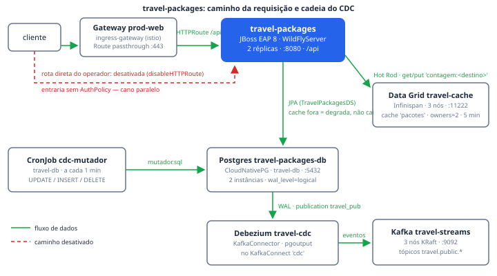

# travel-packages (EAP + cadeia de dados)

O travel-packages é o serviço JBoss EAP 8 que serve o catálogo de pacotes de
viagem — os 480 pacotes e ~1200 reservas que o seed põe no Postgres, filtrados
pelo mesmo `free`/`silver`/`gold` dos planos do RHCL. Ele existe por duas
razões: dar **efeito de negócio** ao Ato 2 (o tier do chamador muda *o que* a
API devolve, não só o quanto ela responde) e **acender a cadeia de
suprimento** que sustenta o Ato 6 — até este módulo nascer, os backends da
demo rodavam a imagem de exemplo do Kiali, e sete produtos (Nexus, SonarQube,
Chains, Rekor, ACS, Quay, Tekton) estavam instalados sem nada passando por
eles. É o primeiro artefato compilável do repositório, e por isso a imagem
dele vem de uma pipeline assinada, não de um registry público.

## Como funciona

**O serviço.** Quem o roda é o operador do EAP, por um `WildFlyServer` (que
vira StatefulSet — procurar `deployment/travel-packages` não acha nada). Não é
preferência de estilo: ao reduzir réplicas, o operador mantém o pod vivo até
as transações pendentes terminarem, em vez de matar no meio — visível ao vivo
com `oc scale wildflyserver travel-packages -n travel-packages --replicas=1`.
O servidor é provisionado **no build** pelo `eap-maven-plugin` (canal
`eap-8.1`), com duas camadas Galleon: `jaxrs-server` e
`postgresql-datasource`. A segunda monta o datasource `TravelPackagesDS` em
tempo de **execução**, a partir das variáveis `POSTGRESQL_*` que o
`WildFlyServer` injeta do Secret `travel-packages-db-app` (gerado pelo
CloudNativePG em `travel-db` e copiado pelo `provision.sh` — `secretKeyRef` só
lê do próprio namespace). Nenhuma senha entra na imagem.

**A leitura.** Cache-aside com degradação. A consulta por destino busca a
chave `contagem:<destino>` no Data Grid via Hot Rod e responde com
`x-cache: hit|miss`; os dados em si vêm do Postgres por JPA. O cliente usa
`clientIntelligence BASIC` de propósito: a topologia que o servidor devolve
são IPs de pod, que mudam a cada reinício — com BASIC ele fala sempre pelo
Service, o endereço estável. Cache fora do ar é lentidão, não
indisponibilidade: o `/api/saude` reporta `cache: degradado`, mas só o banco
decide o readiness — reprovar a sonda por causa do cache tiraria de rotação um
pod que está funcionando.

**A cadeia de dados (o movimento).** O CronJob `cdc-mutador` roda o
`mutador.sql` a cada minuto contra o Postgres: preços oscilam até 2%, vagas se
movem, reservas nascem, confirmam e às vezes somem (o DELETE do CDC). O
Debezium (`KafkaConnector travel-cdc`, plugin `pgoutput`, hospedado no
`KafkaConnect cdc`) lê o WAL pela publication `travel_pub` e publica nos
tópicos `travel.public.*` do Kafka `travel-streams`. Sem esse movimento a tela
de tópicos se lê como "a integração não funciona", não como "ninguém mudou
nada ainda". Um POST de reserva no palco também vira evento no tópico — a
cadeia inteira em um gesto.

**A imagem.** A pipeline `build-travel-packages` (Tekton, tudo em `taskSpec`
inline — nada de resolver remoto que falhe em cluster sem internet) faz:
`clona` do GitLab do cluster → `compila` (Maven, cache no PVC `cache-maven`) →
`portao-de-qualidade` no SonarQube com `-Dsonar.qualitygate.wait=true` (sem
essa flag o portão existe e não tem efeito nenhum) → `constroi-imagem` com
buildah sobre a base `eap81-openjdk17-runtime` e push no Quay do cluster. O
Tekton Chains assina o resultado sozinho — os results chamam-se `IMAGE_URL` e
`IMAGE_DIGEST` porque é convenção do Chains, não escolha nossa — e registra no
Rekor; o ACS mede o workload no cluster (anotação `acs/deployment-name`). Se o
portão reprova, o buildah não roda e não há imagem para assinar: o portão
interrompe a cadeia, que é o ponto.

**A borda.** A HTTPRoute anexa ao **mesmo** Gateway `prod-web` dos outros
atos, em `pacotes-travels.apps.<domínio>` — um segundo gateway contaria uma
história diferente da que a demo defende. Quem publica o hostname é uma Route
passthrough (o `prod-web` não tem LoadBalancer neste cluster); o TLS termina
no Gateway, que é quem detém o certificado e aplica as policies. A Route
própria que o operador do EAP criaria está desligada
(`disableHTTPRoute: true`): seria um cano paralelo sem AuthPolicy, sem plano e
sem rate limit — um jeito de a própria demo se desmentir. AuthPolicy e
PlanPolicy próprias são da camada da demo (`base/`) e entram com o Ato 8; até
lá a rota responde sem autenticação, que é o estado correto para conferir que
o serviço subiu.

## Fatos medidos

| Fato | Valor (do manifesto/código) |
| --- | --- |
| Workload | `WildFlyServer travel-packages`, namespace `travel-packages` (no Service Mesh) |
| Réplicas | 2 |
| Porta / caminho | 8080 · API sob `/api` (`@ApplicationPath`) |
| Imagem | `<quay-do-cluster>/rhcl/travel-packages:latest`, construída pela pipeline; base `registry.redhat.io/jboss-eap-8/eap81-openjdk17-runtime-openshift-rhel9` |
| Requests / limits | cpu `500m`, memória `1Gi` / limite de memória `2Gi` |
| Sondas | as três em `GET /api/saude:8080`; startup 30×10s (~5 min de tolerância — o primeiro pull da imagem de 546MB não sobe em 10s) |
| Datasource | `TravelPackagesDS` → `travel-packages-db-rw.travel-packages.svc:5432`, banco `travelpackages`, Secret `travel-packages-db-app` |
| Cache | Hot Rod em `travel-cache.travel-packages.svc:11222`, cache `pacotes` (3 nós, `owners=2`, lifespan 5 min) |
| Bind | `SERVER_PUBLIC_BIND_ADDRESS=0.0.0.0` — obrigatório no Service Mesh (ver "Quando quebra") |
| ServiceAccount | `travel-packages`, com o secret `quay-pull` vinculado pelo `provision.sh` |
| Service de backend | `travel-packages-loadbalancer:8080` — o nome é do operador, não nosso |
| Exposição | HTTPRoute `travel-packages` → Gateway `prod-web` (`ingress-gateway`) em `pacotes-travels.apps.<domínio>`; Route passthrough `travel-packages-gateway` → `prod-web-istio:443` (porta numérica, não o nome `https`) |
| Policies | nenhuma própria neste manifesto — entram com o Ato 8, pela camada `base/` |
| Pipeline | `build-travel-packages`: `clona` → `compila` → `portao-de-qualidade` → `constroi-imagem`; assinada pelo Chains via results `IMAGE_URL`/`IMAGE_DIGEST` |
| Chave no SonarQube | `com.redhat.travel:travel-packages` (groupId:artifactId — o maven-sonar-plugin a deriva do POM) |

## Onde ver

- **Portal RHDH → Component `travel-packages`**: aba CI (PipelineRuns, pelo
  seletor `app=travel-packages`), aba Kubernetes (StatefulSet e pods), o card
  do SonarQube (`com.redhat.travel:travel-packages`), a aba do ACS
  (`travel-packages/travel-packages`), traces no Jaeger
  (`travel-packages.travel-packages`, lookback 168h) e o repositório no GitLab
  (`rhcl/travel/travel-packages`).
- **Portal RHDH → System `Pacotes de viagem`**: os seis Resources da cadeia
  (Postgres, Data Grid, Kafka, KafkaConnect, Debezium, mutador) com as
  dependências entre eles.
- **Console OpenShift**: os tópicos `travel.public.*` em `travel-streams` e o
  `oc get jobs -n travel-db` mostrando o mutador rodando a cada minuto.
- **Grafana do cluster**: as reservas assinadas por parceiro casam com a
  dimensão `partner` de `istio_requests_total` — o mesmo nome que compra
  pacote aparece no gráfico de tráfego.

## Quando quebra

- **Pod `1/2 Running` para sempre, e quem chama recebe `upstream connect
  error`** — faltou `SERVER_PUBLIC_BIND_ADDRESS=0.0.0.0`. A imagem do EAP
  liga no IP do pod; o Envoy entrega o tráfego em `127.0.0.1:8080`, onde não
  há ninguém. O log do EAP diz `started` sem erro nenhum — o servidor está
  perfeito, só inalcançável. E `-Djboss.bind.address` em `JAVA_OPTS_APPEND`
  **não** resolve: o `-b` que o launcher da imagem monta na linha de comando
  vence a propriedade de sistema. Medido em 2026-08-28.
- **CrashLoopBackOff com o servidor subindo limpo toda vez** — sondas sem
  `startupProbe` explícita deixam a do operador valendo, e ela consulta um
  endpoint de health que a camada `jaxrs-server` não entrega (404). O kubelet
  reporta `failed startup probe, will be restarted` e mata o container antes
  de qualquer outra sonda rodar. Por isso as três sondas apontam para o
  recurso JAX-RS `/api/saude`. Medido em 2026-08-28.
- **ImagePullBackOff** — dois casos distintos com o mesmo sintoma: a tag não
  existe no Quay (a pipeline nunca rodou — este manifesto não constrói nada,
  e esse é o sintoma correto) ou o erro traz `unauthorized` (falta o secret
  `quay-pull` na ServiceAccount, que se lê erradamente como tag errada).
