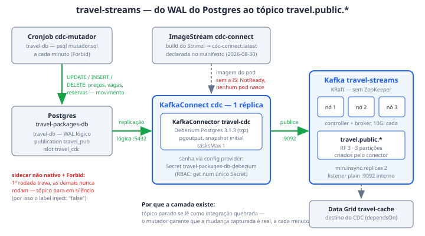

# travel-streams

O `travel-streams` é a camada de streaming do System *Pacotes de viagem*: um
cluster Kafka dedicado (Streams for Apache Kafka) e o Debezium que transforma
cada mudança no Postgres em evento nos tópicos `travel.public.*`. Serve ao Ato
6 — o portal que reflete a plataforma — e obedece à regra que motiva tudo
nesta camada: a demo precisa de volume e movimento **reais**, porque tópico
parado se lê como integração quebrada, não como "ninguém mudou nada ainda".
Quatro entidades do catálogo moram aqui, de propósito separadas: o broker
(Resource `travel-streams`), o runtime que hospeda plugins (`cdc-connect`), o
conector que de fato lê o banco (`travel-cdc`) e o gerador de movimento
(`cdc-mutador`) — confundir runtime com conector é o que faz procurar erro de
conexão no lugar errado.

## Como funciona

**O Kafka em KRaft.** O CR `Kafka travel-streams` roda sem ZooKeeper: o canal
`stable` do operador já é a linha 3.2, e as duas annotations do CR
(`strimzi.io/node-pools: enabled`, `strimzi.io/kraft: enabled`) são
obrigatórias nesse regime. Os nós vêm do `KafkaNodePool dual`: **3 réplicas
combinadas** (`roles: [controller, broker]`), cada uma com 10Gi de
`persistent-claim` e `deleteClaim: true` — apagar o cluster leva o storage
junto, coerente com um cluster efêmero. Um único listener `plain` em `:9092`,
interno e sem TLS. A replicação é honesta para 3 nós:
`default.replication.factor: 3`, `min.insync.replicas: 2`, e os tópicos de
offsets e transações com RF 3. A **versão do Kafka fica por conta do
operador** — fixá-la no CR quebraria no próximo upgrade de canal, e a demo não
depende de minor.

**O build do Connect — e a ImageStream que ele não cria.** O `KafkaConnect
cdc` (1 réplica, bootstrap `travel-streams-kafka-bootstrap:9092`) não usa uma
imagem pronta: o Strimzi **constrói** a imagem com o conector do Debezium via
BuildConfig, com `build.output.type: imagestream` — é OpenShift, não há
registry externo no caminho — publicando em `cdc-connect:latest`. A
ImageStream `cdc-connect` é **declarada no próprio manifesto** (correção de
2026-08-30): o Strimzi constrói para dentro dela mas não a cria, e sem ela o
KafkaConnect fica NotReady sem que nenhum pod nasça. O plugin entra como
`tgz` (`debezium-connector-postgres-3.1.3.Final-plugin.tar.gz`), e **não**
como `type: maven`: o maven resolve transitivas e põe jars do próprio Kafka no
diretório do plugin — o classloader do Connect sombreia o runtime (ver
"Quando quebra"). Detalhe da API `v1` do Strimzi: `groupId` e os tópicos de
storage (`cdc-offsets`, `cdc-configs`, `cdc-status`) são campos de primeira
classe — deixá-los em `config` é erro de validação, não aviso.

A senha do Postgres **não está no CR**: o config provider de Secrets do
Strimzi (`KubernetesSecretConfigProvider`) resolve
`${secrets:travel-streams/travel-packages-db-debezium:password}` em tempo de
execução. O Secret é uma réplica do que o CNPG gerencia em `travel-db` —
duplicar uma senha lab-grade é mais simples que RBAC entre namespaces — e o
RBAC local é mínimo: a Role `le-secret-debezium` dá `get` num único Secret, e
o RoleBinding `cdc-connect-le-secret` a entrega só à ServiceAccount
`cdc-connect`.

**O conector Debezium.** O `KafkaConnector travel-cdc` (label
`strimzi.io/cluster: cdc`; a annotation `use-connector-resources` no Connect é
o que faz o CR virar conector de verdade) roda o `PostgresConnector` com
`tasksMax: 1` contra `travel-packages-db-rw.travel-db.svc:5432`, database
`travelpackages`, usuário `debezium`. Lê o WAL por replicação lógica:
`plugin.name: pgoutput`, publication `travel_pub` com
`publication.autocreate.mode: disabled` — quem cria a publication é o seed do
banco, porque só o dono das tabelas pode —, slot `travel_cdc` e
`snapshot.mode: initial`. O `topic.prefix: travel` produz os tópicos
`travel.public.*`, criados pelo próprio conector (`topic.creation.default`:
RF 3, 3 partições) — nada declarado à mão, como diz a entidade do catálogo.

**O movimento.** O CronJob `cdc-mutador` vive em `travel-db` (onde estão o
SQL e a credencial do banco, não aqui) e roda `psql -f /sql/mutador.sql` a
cada minuto contra o Postgres — preços oscilam, vagas se movem, reservas
nascem e confirmam. É deliberadamente um CronJob, e não um loop num
Deployment: cada rodada é uma transação curta, o custo aparece em
`oc get jobs`, e pausar a demo é um patch de `suspend` — sem matar pod. A
decisão de sync manual do survey não se aplica aqui: lá o comando ao vivo é
parte da narrativa; aqui o fluxo contínuo **é** a narrativa. O destino da
cadeia é o cache do Data Grid — o Resource `travel-cache` declara `dependsOn`
deste conector, e é por isso que pacote desatualizado na tela é sintoma do
CDC, não da aplicação.

## Fatos medidos

| Fato | Kafka `travel-streams` | KafkaConnect `cdc` + KafkaConnector `travel-cdc` | CronJob `cdc-mutador` |
| --- | --- | --- | --- |
| Objeto / namespace | `Kafka` + `KafkaNodePool dual` em `travel-streams` | `KafkaConnect` + `KafkaConnector` em `travel-streams` | `CronJob` em `travel-db` |
| Réplicas | 3 nós combinados (`controller` + `broker`), KRaft | 1 réplica; `tasksMax: 1` no conector | 1 rodada/min (`schedule: * * * * *`, `concurrencyPolicy: Forbid`) |
| Imagem | do operador (canal `stable`, linha 3.2 — versão não fixada de propósito) | construída pelo Strimzi → ImageStream `cdc-connect:latest`, plugin `debezium-connector-postgres 3.1.3.Final` (tgz) | `ghcr.io/cloudnative-pg/postgresql:18.4-system-trixie` |
| Porta / endereço | listener `plain` `:9092`, interno, sem TLS | bootstrap `travel-streams-kafka-bootstrap:9092`; lê `travel-packages-db-rw.travel-db.svc:5432` | escreve em `travel-packages-db-rw.travel-db.svc`, database `travelpackages` |
| Storage | `persistent-claim` 10Gi por nó, `deleteClaim: true` | tópicos internos `cdc-offsets` / `cdc-configs` / `cdc-status` (RF 3) | ConfigMap `travel-packages-sql` montado em `/sql` |
| Requests | cpu 300m, mem 1Gi (por nó) | cpu 300m, mem 1Gi | nenhum declarado |
| Limits | mem 2Gi (sem limite de cpu) | mem 2Gi (idem) | nenhum |
| Replicação | `default.replication.factor: 3`, `min.insync.replicas: 2`; offsets e transações RF 3 (min ISR 2) | `topic.creation.default`: RF 3, 3 partições; `topic.creation.enable: true` | — |
| CDC | — | `pgoutput`, publication `travel_pub` (autocreate desligado), slot `travel_cdc`, `snapshot.mode: initial`, `topic.prefix: travel` | gera os UPDATEs que o conector captura |
| Secrets / RBAC | — | `travel-packages-db-debezium` via config provider; Role `le-secret-debezium` + RoleBinding `cdc-connect-le-secret` (`get` num único Secret, SA `cdc-connect`) | `travel-packages-db-app` (PGUSER/PGPASSWORD) |
| Ciclo do Job | — | — | `backoffLimit: 1`, `ttlSecondsAfterFinished: 600`, histórico 2 sucessos / 2 falhas; label `sidecar.istio.io/inject: "false"` |
| Policies | nenhuma policy do RHCL seleciona esta camada — é tráfego leste-oeste interno; a governança da demo acontece na borda, no `prod-web` | idem | idem |

## Onde ver

- **Portal RHDH → System *Pacotes de viagem***: os quatro Resources — *AMQ
  Streams — travel-streams*, *KafkaConnect — cdc*, *Debezium — travel-cdc* e
  *CronJob — mutador do CDC* — cada um ancorado num objeto real do cluster via
  `rhcl.demo/cluster-object`. Num cluster sem a etapa `pacotes` do
  `provision.sh`, todos saem do portal sozinhos em vez de descrever recursos
  que não existem. O grafo de dependências conta a cadeia: mutador → banco,
  conector → runtime + banco, cache → conector.
- **Console OpenShift**: os tópicos `travel.public.*` em `travel-streams` — a
  prova de que a cadeia anda é o tópico em movimento.
  `oc get kafkaconnector -n travel-streams` mostra o READY do `travel-cdc`;
  `oc get kafka,kafkaconnect -n travel-streams`, o estado do cluster e do
  runtime.
- **`oc get jobs -n travel-db`**: as rodadas do mutador, uma por minuto.
  Pausar a demo é
  `oc patch cronjob cdc-mutador -n travel-db -p '{"spec":{"suspend":true}}'`.

## Quando quebra

- **KafkaConnect NotReady com `there is no image stream with name
  cdc-connect` — e nenhum pod de connect nasce.** O Strimzi constrói a imagem
  *para dentro* da ImageStream, mas não a cria. Medido em 2026-08-30 em
  cluster recém-provisionado (num cluster anterior ela existia de uma criação
  manual perdida no tempo);
  desde então a IS é declarada no próprio `04-kafka.yaml`. Se o sintoma
  voltar, é ela que sumiu.
- **`Could not instantiate class` no PUT do conector — até para o
  `JsonConverter` de fábrica.** É a assinatura do artefato `type: maven`: o
  maven resolve transitivas e põe jars do próprio Kafka no diretório do
  plugin, e o classloader do Connect sombreia o runtime. O manifesto usa o
  `tar.gz -plugin` que a doc do Debezium manda — trocar por maven reintroduz o
  problema (medido em 2026-08-30).
- **Tópico do CDC parado sem erro em lugar nenhum.** Onde o sidecar do Istio
  não é init container nativo, um Envoy que nunca termina deixa o pod do
  mutador NotReady para sempre — e, com `concurrencyPolicy: Forbid`, a
  primeira rodada travada bloqueia todas as seguintes. É por isso que o label
  `sidecar.istio.io/inject: "false"` fica no template mesmo neste cluster,
  onde as rodadas completam sem ele. Antes de investigar o conector, conferir
  também se alguém pausou o CronJob com `suspend: true`.
