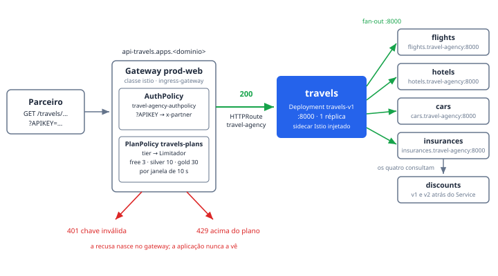

# travels — o orquestrador da travel-agency

O `travels` é o único serviço da travel-agency exposto ao mundo: a HTTPRoute
`travel-agency` entrega a ele tudo o que atravessa o Gateway `prod-web`, e ele
transforma cada requisição num fan-out para os demais backends do namespace.
Na demo ele é o palco dos Atos 1 e 2 — é sobre esta rota que a
`AuthPolicy travel-agency-authpolicy` decide **quem entra** (200 ou 401) e a
`PlanPolicy travels-plans` decide **quanto passa por tier** (200 ou 429). O
detalhe que sustenta a tese: o `travels` não tem uma linha de autenticação nem
de rate limit; a governança inteira mora nas policies, na borda. RHCL como
plataforma de API, não como gateway.

## Como funciona

O caminho de uma requisição, na ordem em que as decisões acontecem:

1. **Hostname.** A base declara `api.travels.example.com` (sanitizado); o
   overlay de `env/` reescreve para o domínio real do cluster — a forma
   genérica é `api-travels.apps.<domínio>`. O cluster é efêmero: hostname se
   descobre na hora, nunca se copia de documento.
2. **Deny-all do Gateway.** O `prod-web` carrega a AuthPolicy
   `prod-web-deny-all` (escopo de Gateway): rota sem AuthPolicy própria é
   negada com um JSON de `Forbidden`. A rota `travel-agency` escapa porque tem
   a sua.
3. **AuthPolicy `travel-agency-authpolicy`** (escopo de rota). O Authorino
   valida o parâmetro de query `APIKEY` contra Secrets com label
   `app: partner` — `allNamespaces: false`, ou seja, só no namespace onde ele
   roda, `kuadrant-system`. Chave ausente ou inválida: **401**, sem identidade
   (a métrica sai com `partner="unknown"`). Sucesso: a policy injeta o header
   `x-partner` com a identidade — a annotation `secret.kuadrant.io/user-id`
   quando a chave veio do developer portal, o nome do Secret quando veio do
   repositório — e é esse header que o Telemetry do Istio transforma em
   dimensão de métrica por parceiro.
4. **PlanPolicy `travels-plans`** (escopo de rota). O controller classifica a
   identidade no primeiro plano cujo predicado CEL casar: lê o label
   `kuadrant.io/plan-id` do Secret, com fallback para a annotation
   `secret.kuadrant.io/plan-id` (é assim que nasce a chave aprovada no
   developer portal). O WasmPlugin do Gateway consulta o Limitador por
   `auth.kuadrant.plan == "<tier>"`; acima do limite da janela: **429**.
5. **Só então a aplicação.** Dentro do plano, a HTTPRoute (`PathPrefix /`)
   encaminha ao Service `travels:8000`.

O 401 e o 429 são portanto comportamento **desenhado**, não falha: nascem no
gateway e o pod `travels-v1` nunca vê essas requisições. É o que permite medir
recusa por parceiro no Grafana (`istio_requests_total{response_code="429"}`)
sem instrumentar a aplicação.

Do lado de dentro, o `travels` é o orquestrador: recebe a chamada e a espalha
pelos quatro serviços declarados em variáveis de ambiente — `FLIGHTS_SERVICE`,
`HOTELS_SERVICE`, `CARS_SERVICE` e `INSURANCES_SERVICE`, todos
`http://<serviço>.travel-agency:8000` — e cada um deles consulta o
`discounts`, fechando os cinco backends atrás de uma única chamada de API. O
pod roda com sidecar do Service Mesh (`sidecar.istio.io/inject: "true"`) e
exporta traces para `zipkin.istio-system:9411` com sampling de 10% e custom
tags dos headers `portal`, `device`, `user` e `travel` — é daí que saem o
grafo do Kiali e a aba de traces do portal.

## Fatos medidos

| Fato | Valor (do manifesto) |
| --- | --- |
| Deployment | `travels-v1`, namespace `travel-agency` |
| Réplicas | 1 (RollingUpdate, `maxSurge`/`maxUnavailable` 25%) |
| Imagem | `quay.io/kiali/demo_travels_travels:v1` |
| Porta | 8000/TCP (`LISTEN_ADDRESS=:8000`; Service `travels`, ClusterIP, `port` = `targetPort` = 8000) |
| Requests/limits | não declarados (`resources: {}`) |
| SecurityContext | `readOnlyRootFilesystem: true`, `capabilities.drop: [ALL]`, sem escalonamento de privilégio |
| Backends (env) | `FLIGHTS_SERVICE`, `HOTELS_SERVICE`, `CARS_SERVICE`, `INSURANCES_SERVICE` → `http://<svc>.travel-agency:8000` |
| HTTPRoute | `travel-agency` → Gateway `prod-web` (namespace `ingress-gateway`), `PathPrefix /` |
| AuthPolicy | `travel-agency-authpolicy` — API key em `?APIKEY=`, Secrets `app: partner` em `kuadrant-system`, injeta header `x-partner` |
| PlanPolicy | `travels-plans` — gold 30 req/10s (100000/dia), silver 10 req/10s (10000/dia), free 3 req/10s (1000/dia), catch-all `unclassified` 1 req/60s |
| Tracing | Zipkin em `zipkin.istio-system:9411`, sampling 10%, custom tags `portal`/`device`/`user`/`travel` |
| Ligação com o portal | label `app: travels` no Deployment, na HTTPRoute e nas duas policies — é o que o `backstage.io/kubernetes-label-selector` da entidade casa |

## Onde ver

- **Portal RHDH, Component `travels`**: a aba **Kubernetes** mostra, pelo
  seletor `app=travels`, o Deployment, a HTTPRoute e as duas policies juntos —
  não existe plugin de Connectivity Link; o label é o caminho. A aba
  **Topology** desenha o nó (graças ao `metadata.labels` do Deployment, que
  espelha o selector de propósito), e as abas de traces
  (`travels.travel-agency`, lookback de 168 h) e **Imagem** (Quay,
  `kiali/demo_travels_travels`) completam o quadro.
- **Console OpenShift**: as entidades do catálogo linkam direto a
  `AuthPolicy/travel-agency-authpolicy` e `PlanPolicy/travels-plans` no
  namespace `travel-agency`.
- **Grafana**: `rhcl-negocio-planos` (link no System `travel-agency`) mostra os
  três tiers; `rhcl-negocio-parceiros` mostra consumo e 429 por parceiro — a
  dimensão que o header `x-partner` cria.
- **Terminal**: `bash scripts/traffic.sh tiers` põe os três planos lado a lado
  (200 até o limite, 429 depois); `bash scripts/preflight.sh` verifica a
  cadeia inteira.
- **Kiali** (namespace `travel-agency`): o fan-out ao vivo, com o `discounts`
  no fim da cadeia.

## Quando quebra

- **Overlay da release errada.** O `overlays/provisioned` readiciona a
  RateLimitPolicy plana, que no RHCL 1.4 **sobrepõe** o PlanPolicy: a RLP
  gerada por ele fica `Enforced=False` ("overridden"), os três tiers somem e
  tudo responde 200 — sem sintoma nenhum no caminho de dados. Os scripts
  detectam a release pelo CSV do operator e sugerem o overlay certo.
- **Chave sem tier e o fail-open do CEL.** Indexar chave ausente em CEL não
  devolve `false`: **erra**, e o erro aborta a classificação inteira —
  inclusive o catch-all — deixando a requisição passar **sem limite**. Por
  isso todos os predicados são guardados com `has(...)` e o plano
  `unclassified` (1 req/60s) fica por último, deliberadamente apertado: chave
  emitida sem `plan-id` produz 429 cedo e visível, em vez de consumo
  invisível.
- **Editar limites sem `traffic.sh reset`.** O Limitador guarda cada contador
  com o `max_value` vigente na criação: um contador existente segue com o teto
  antigo até a janela virar — 24 h na cota diária — e a edição parece não ter
  pego. Foi cota diária baixa, aliás, que já matou a demo uma vez: três
  ensaios consumiam o free do dia e o Ato 2 virava 429 puro até 00:00 UTC
  (armadilha 8 do RUNBOOK); daí as diárias altas mantendo a razão 1:10:100.
